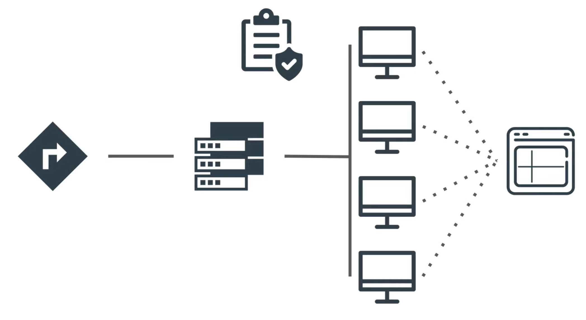

# Azure Infrastructure Operations Project: Deploying a scalable IaaS web server in Azure

## Introduction
This is my solution for the 1st project in Udacity's DevOps Engineer for Azure Nanodegree Program.
This goal of this project is to provide infrastructure-as-code for a high availability, scalable web server that is deployed in Microsoft Azure. To deploy the infrastructure, you must leverage Terraform and Packer as decribed below.

## Getting Started / Summary
### 1. Prepare the local environment
This section explains how to set up a desktop computer or workstation (Linux or MacOS) for this project.  

#### Verify installation of tools
After installing all tools listed in the Dependencies-section, run the following checks to be sure, that your environment is ready.

* Run `$ az --version`, to make sure, the Azure command line interface is installed (this command should return `2.15.1` or higher). Login by running `$ az login`.
* Run `packer --version` to check, that Packer is installed (this command should return `1.6.5` or higher).
* Run `terraform --version` to check, that Terraform is installed (this command should return `v0.14.0` or higher).

#### Give credentials to Terraform & Packer
Terraform must be given necessary credentials in Azure in order to be able so spawn resources as defined in the artifacts.

* Create a service principle in Azure for Terraform.
* Run `az login` to log into your Azure account. Now get the tenant-id by running `az account show`. Paste the tenant id as `default = "XXX"` into vars.tf in the tenant_id-section.
* Run `terraform init` to get started. Terraform will now draw necessary packages, a successful init will return *Terraform has been successfully initialized!*.

Packer must be given necessary credentials in Azure, too. To create a service principle in Azure for Packer as explained [here](https://docs.microsoft.com/en-us/azure/virtual-machines/linux/build-image-with-packer),   
* Run `$ az ad sp create-for-rbac --query "{ client_id: appId, client_secret: password, tenant_id: tenant }"`.
* Create the following environment variable using the output of the last command: `ARM_CLIENT_ID` and `ARM_CLIENT_SECRET`
* Run `$ az account show --query "{ subscription_id: id }"`.
* Create the following environment variable using the output of the last command: `ARM_SUBSCRIPTION_ID`

### 2. Create your infrastructure as code
This section explains hot to provision the infrastructure for the high-availability web server in Azure. Individual tasks have been wrapped up in shell-scripts. To see the commands, open these in your favorite text editor.

* Create the resource group for the custom image by running `$ chmod u+x create_resource_group_for_image.sh && ./create_resource_group_for_image.sh`.

* Create & deploy the custom image with Packer by running `$ chmod u+x create_image_in_Azure.sh && ./create_image_in_Azure.sh`.

* Retrieve the image-id from the command line and paste it into vars.tf (at line 38).

* Plan the infrastructure you are about to deploy in Azure by running `$ terraform plan -out solution.plan`

* Create the infrastructure in Azure by running `$ terraform apply`

### 3. Inspect your infrastructure in Microsoft Azure
The creation of the infrastructure takes a few minutes. You can inspect the result in the portal by going to resource groups and search for the recently created resource groups.

In Azure's portal you will be able to inspect the majority of objects by selecting the  resource group `udacity-devops-4-azure-nanodegree` visible in the figure below.

As an alternative, run `$ terraform show` and the infrastructure will be displayed in convenient json-format. In Azure's portal you will be able to inspect the image by selecting the  resource group `images-4-udacity-devops-4-azure-nanodegree` visible in the figure below.

### 4. Destroy your infrastructure in Microsoft Azure
The infrastructure is deleted by removing both the stack created by terraform and the image from Azure. These activities are wrapped up in a shell script. To clean up Azure, run `$ chmod u+x clean_up_Azure.sh && ./clean_up_Azure.sh`

## Dependencies
These dependencies must be settled before the infrastructure can be deployed in Microsoft Azure.

* Create an [Azure Account](https://portal.azure.com)
* Install the [Azure command line interface](https://docs.microsoft.com/en-us/cli/azure/install-azure-cli?view=azure-cli-latest)
* Install [Packer](https://www.packer.io/downloads)
* Install [Terraform](https://www.terraform.io/downloads.html)

### Instructions
Run every command inside a clone of this repository.
The following sections describe the tuneable parameters and important limitations for modifications.
#### Parameters
These parameters are contained in vars.tf & can be changed by the user:
* *tenant_id*: This is the tenant_id, run 'az account show' at the command line to get it.
* *prefix*: The prefix will be used for all resources in this project.
* *location*: The Azure Region in which all resources in this example will be created.
* *admin_username*: This is the user-name of the administrator of the virtual machines.
* *admin_password*: This is the password that the administrator of the virtual machines must use to log in.
* *project_tag_value*: This will be the name of the resource group that keeps the majority of resources (subnet, virtual machines,...). It is also a tag-value; each resource that can be tagged will have this project tag (must be enforced by policy to be sure!). This way we can track resources associated with this project.
* *number_of_virtual_machines*: This is the number of virtual machines that must be created.
* *image_id*: This is the id of the image that was generated & deployed by packer. Get it by running `az image list` and look for id : /subscriptions/...providers/Microsoft.Compute/...".

#### Notes & limitations for modifications
The resource group for the images must be the same in these two files:

* create_resource_group_for_image.sh
* server.json

If there is a need to change it, change it in both files. The path to the image will in turn change, hence a new *image_id*-variable must be provided upon re-creation of the infrastructure.

### Output
A high-availability web-server is deployed in Azure.
